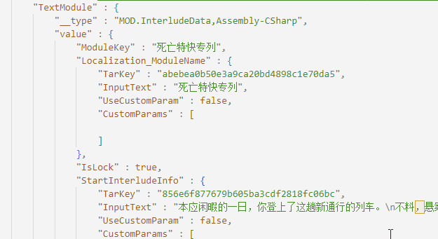

# Depersonalization-Schema
游戏 人格解体中相关json文件所对应的Json Schema

# 完成状况

- [ ] TextModule <---- 整理中
- [ ] Achievement
- [ ] BattleSkill
- [ ] Buff
- [ ] Career
- [ ] Charator
- [ ] CommonBattleEffectShow
- [ ] HelpSystemData
- [ ] InterludeStudy
- [ ] InterludeVacat
- [ ] Item
- [ ] ItemProcess
- [ ] Magic
- [ ] MonsterBattleSkill
- [ ] MythicalItem


# 如何使用

1. 使用 Visual Studio Code 打开 `StreamingAssets` 目录。
2. 修改当前 Workspace 的 VSCode 配置，即 `./.vscode/settings.json`（不同系统下可能目录有差别），加入以下的配置项
```json
{
    "workbench.editorAssociations": {
    },
    "files.associations": {
        "*.txt": "json"
    },
    "json.schemas": [
        {
            "fileMatch": [
                "*.txt"
            ],
            "url": "https://raw.githubusercontent.com/hxdnshx/Depersonalization-Schema/main/segment.json"
        }
    ]
}
```
3. 之后你就可以享受由此 Schema 提供的相关补全/提示功能了。

